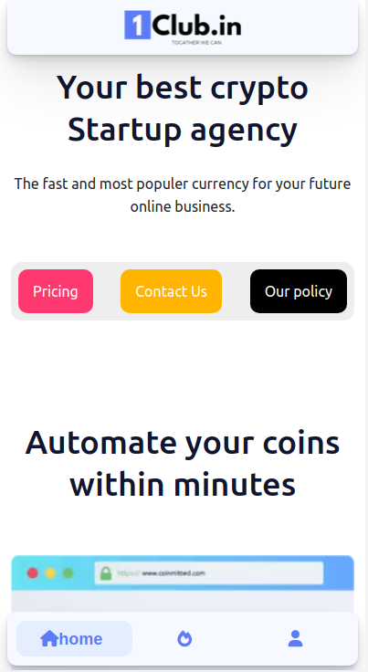
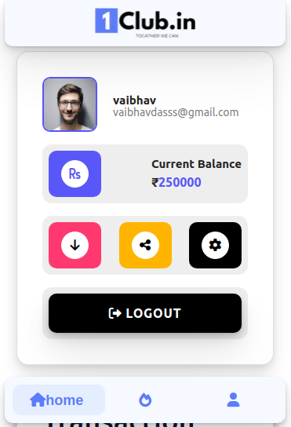
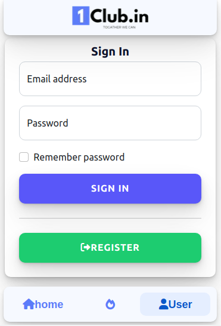
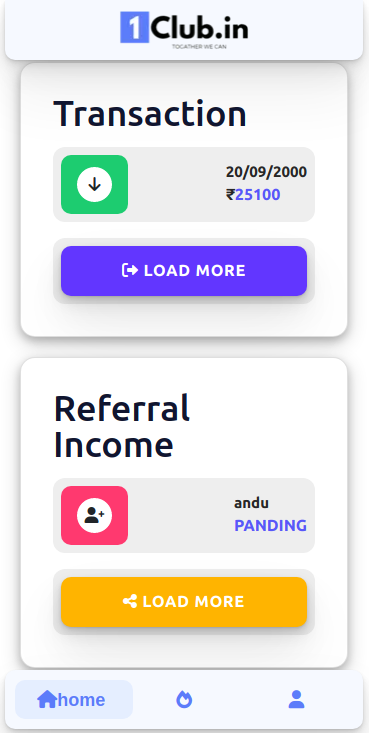

# 1Club 
[for live example](https://1club.in)

1Club is an innovative Cryptocurrency MERN Web application source. This Crypto theme is designed for businesses and individuals in the decentralized digital currency space. The 1CLUB BitCoin & cryptocurrency MERN template is an exclusive niche theme for Cryptocurrency Investments, Bitcoin Exchange, Mining related sites.

## Installation

Use the npm package manager [npm](https://docs.npmjs.com/downloading-and-installing-node-js-and-npm) to install iclub.

```bash
sudo apt install npm
```
cheak npm version
```bash
npm -v
node -v
```

```bash
npm install
```

## Start Nodejs Dev Environment 

```bash
cd client 
node app.js
```
## 1CLub Homepage



## About



## Login



## Transaction



## Contributing
Pull requests are welcome. For major changes, please open an issue first to discuss what you would like to change.

Please make sure to update tests as appropriate.

## License
[MIT](https://choosealicense.com/licenses/mit/)
